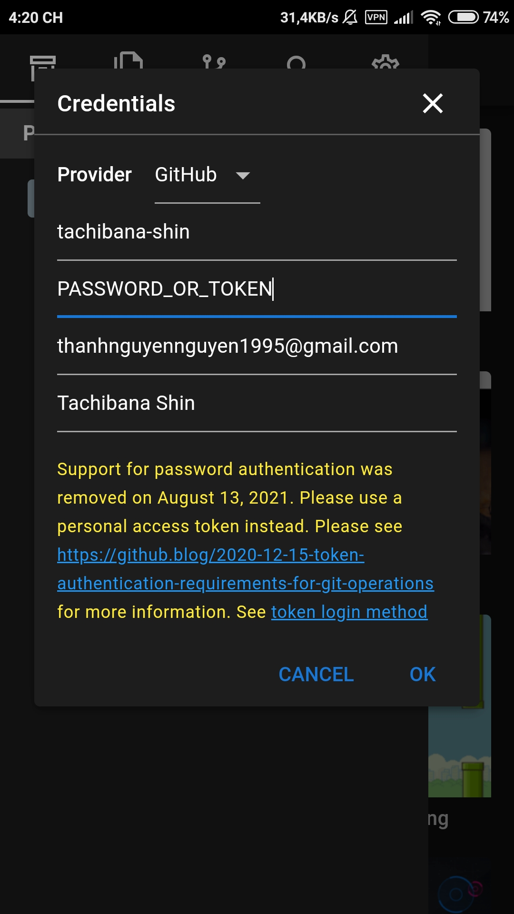
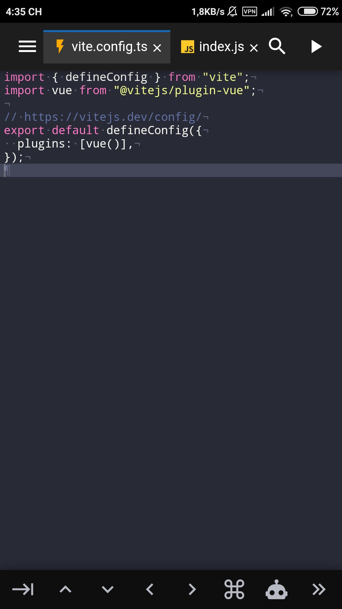
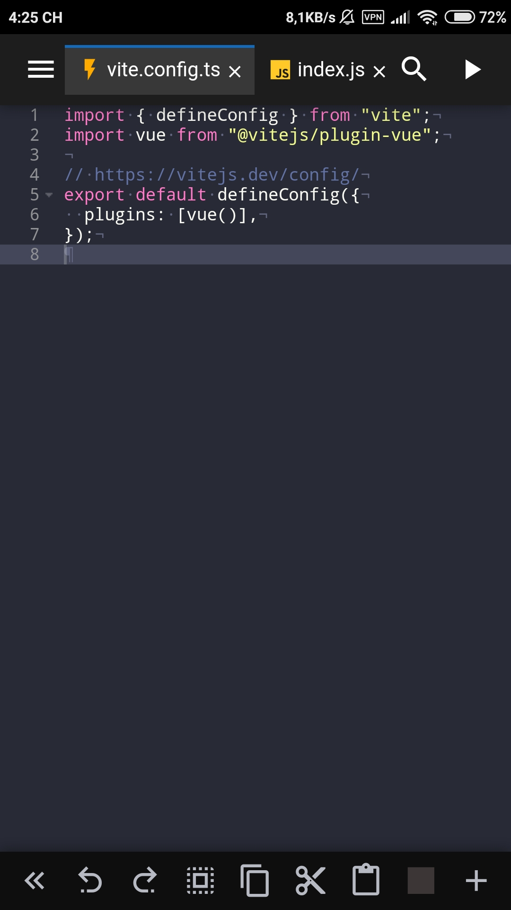

# Editor Settings

The editor settings tab can be used to change various settings of Shin Code Editor.
> Here are some standout settings. The rest of

---

## Git

* __Credentials__: Opens up the GIT Credential modal to change credentials used for different GIT providers (i.e. Github, Gitlab, Bitbucket, Other)

This is an example of using a Github app token to connect to your Github repositories. Cloning or pulling public repositories will not require an app token.

If an invalid app token is set, you will receive "Invalid credentials" error message or "Authentication Error" regardless if the repository is public or private. Make sure you grant the token proper access writes, and allow additional settings to push to the Github/Gitlab/Bitbucket branch. (For example, the master branch may be locked and prevent pushing which will also result in an error.) To properly create an access token, please see [Creating an Access Token for Shin Code Editor.](/create-app-token.html)

[Back to Top](#editor-settings)

---

## Appearance

#### Language
    Use this to change the editor language to a different supported language.

- Currently supported languages include:

    * English (Recommended)
    * Spanish
    * French
    * Portuguese
    * Russian
    * Indonesian
    * Japanese
    * Chinese

[Back to Top](#editor-settings)

#### Theme
    Changes the colors of the code editor. Dark and light editor theme are tied with this setting.

- Light Themes:
    * Ayu Light
    * Chrome
    * XCode
- Dark themes:
    * Ayu Mirage
    * Dracula
    * Monokai
    * One Dark

[Back to Top](#editor-settings)

---

## Editor

#### Autocomplete/Check Syntax

Enables advance autocomplete and syntax checking when available for supported languages. Disabling this can help improve performance as autocompletion feature is memory heavy and may have bad performance on older devices. If you are experiencing frequent crashes, it may be due to a memory issue with your phone and it is recommended to try disabling this setting to improve memory usage.

- Advance Autocompletion Support:
    * JavaScript
    * TypeScript
    * HTML
    * CSS
    * SCSS
    * LESS
    
- Basic Autocompletion:
    * Python
    * Java
    * C
    * Ruby
    * Perl
    * Scala
    * More...

[Back to Top](#editor-settings)

#### Cursor Style

Change the cursor style of the editor. Can choose from "No Blink" or "Slim" cursor.

[Back to Top](#editor-settings)

#### Font Size

Changes the font size of the code editor.

[Back to Top](#editor-settings)

#### Line Numbers

Toggles the line numbers in the code editor. Disable line numbers to create more horizontal editing space for the editor.

[Back to Top](#editor-settings)

#### Show Invisibles

Show invisible characters such as new lines, return carriage, spaces, and tabs. Used to visually differentiate spaces from tabs.

[Back to Top](#editor-settings)

#### Use Soft Tabs

Toggles whether to use "Soft" Tabs versus real tabs. Soft tabs are spaces instead of real tab character. Turn this off to switch to using real tabs `\t`.

[Back to Top](#editor-settings)

#### Word Wrap

Toggles soft line wraps in the code editor.

*Note: These settings affect both the main editor as well as the diff editor.*

[Back to Top](#editor-settings)

---

## Preview

### Live Preview

Turn on and off live previewing in Tablet mode. Live preview will update the side-by-side preview window whenever there is a code change. Updating of the preview will only happen if the preview window is open and has no performance implications when the preview window is not visible. This feature is not useful for phones.

[Back to Top](#editor-settings)