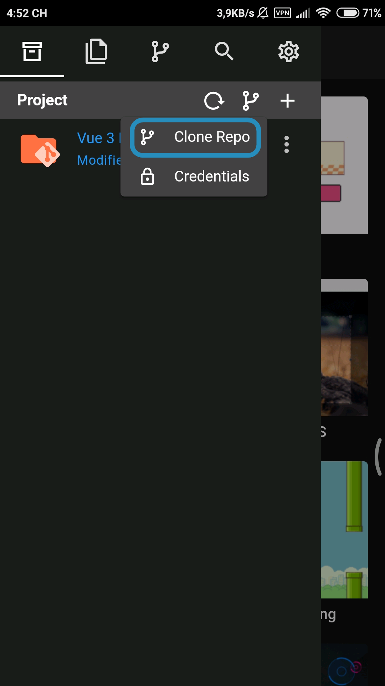
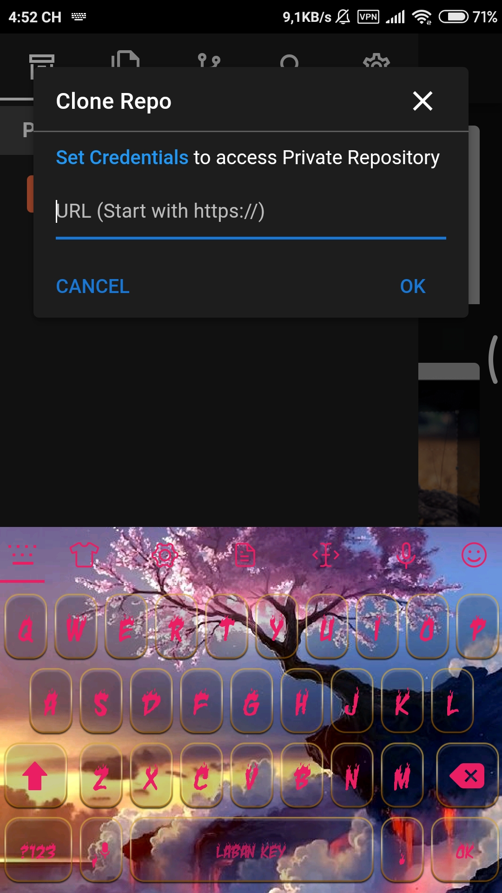
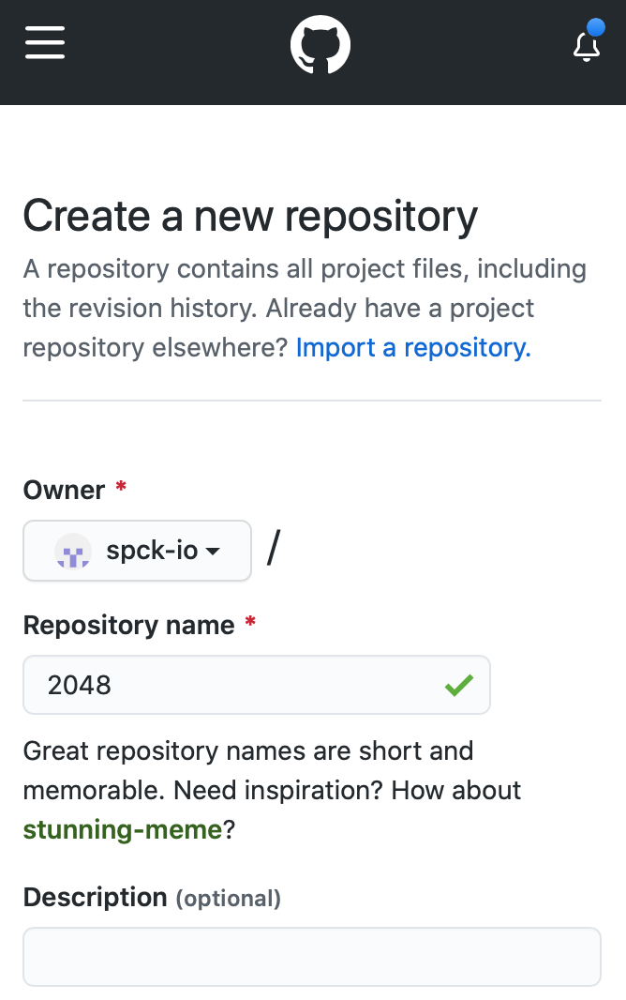
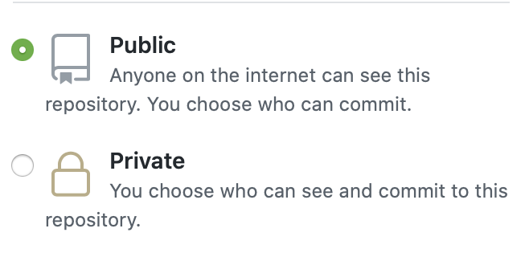
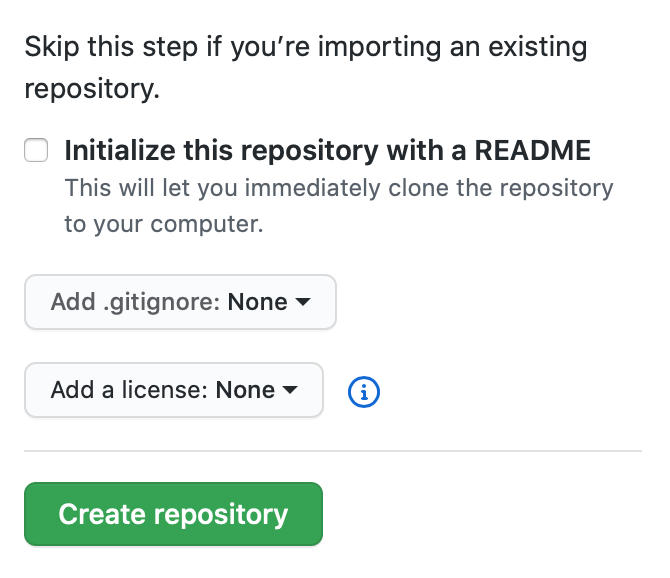
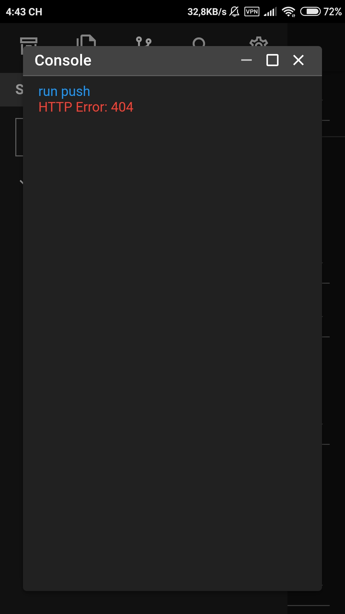

# GIT Guide

GIT is one of the main ways of exporting projects from the editor. GIT support is available for popular GIT hosting (i.e. Github, Gitlab, Bitbucket).

* [Cloning a Repo](#cloning-a-repo)
* [Init a Repo Locally](#local-repo)
* [Connecting a Local Repo to a Remote](#connecting-a-local-repo-to-a-remote)
* [Pushing Repo to Remote](#pushing-repo-to-remote)
* [Check Out Branch](#check-out-branch)
* [Creating a Branch](#creating-a-branch)
* [Switching Branches](#switching-branches)
* [Pushing a Local Branch to Remote](#pushing-a-local-branch-to-remote)
* [Deleting a Branch](#deleting-a-branch)
* [Merge Conflicts](#merge-conflicts)
* [Viewing Diffs](#viewing-diffs)

---

## Cloning a Repo

### Public Repo

Cloning a public repo does not require any credentials.

1. Open the Clone Repo dialog. Click the ⑂ button on the Projects tab.

    

2. Enter the Repo URL (i.e. `https://github.com/arturkot/the-house-game.git`)

    

4. Click OK and the cloning should begin. You can access your cloned project from the Project menu tab.

    <video width="300" autoplay loop muted playsinline src="./img/git-features/cloning.mp4"></video>

### Private Repo

To clone a private repo, you need to set up GIT credentials first. See [Creating an App Token](/create-app-token.html) page for more details.

[Back to Top](#git-guide)

---

## Local Repo

Turn a local project (no remote repo in Github, Gitlab, etc.) for keeping track of history and gain access to git features like diffing, reverting, commiting, etc.

1. Create a project. See `Creating a Project` for more details.
2. Tap to tab `Git` and click `Initial Repo`

[Back to Top](#git-guide)

---

## Connecting a Local Repo to a Remote

To connect a local repostiory to a remote one (BitBucket/Gitlab/Github), follow the steps below. Connecting to a remote repository allows backing up and sharing your work with others that have access to that repository.

1. Create a new repository with a remote provider (i.e. [Github](https://github.com/new)) If you already have an empty repository created, then skip this step.
    
    #### Example with Github
    
    a. Go to [Create Repo](https://github.com/new)) page. Enter a repository name.
    
    
    
    b. Select if the repo will be public or private. For private repo you would need to create an app token to access it. See [Creating an App Token](/create-app-token.html) for more details.
    
    
    
    c. DO NOT initialize the repository with a README as this will create a first commit that will be different from your local repository. The repo must be empty to not have any conflicts with the local one. Click **Create repository** button.
    
    
    d. Save the HTTPS remote repository URL for your remote. You will need this later.

2. Create an initial commit for your repo. If your local repo already has commits, then skip this step.

    <video width="300" autoplay loop muted playsinline src="./img/git-features/commit.mp4"></video>

3. Create your Remote in your project that links to your Remote Repo URL created in step 1.

    <video width="300" autoplay loop muted playsinline src="./img/git-features/create-remote-link.mp4"></video>

4. You can now push your commits to your remote repository. See the next section for details on how to do this.

[Back to Top](#git-guide)

---

## Pushing Repo to Remote

If you want to sync your commits to your remote repository, you can do so pushing the Push feature. To push commits to your remote, follow the steps below:

1. You need to have created an app token to push. You must be the owner of the public repo to push to public repos. To create an app token please see [Creating an App Token](/create-app-token.html) page.

2. Open the GIT menu on the Git menu tab, and Click Push to push any unpushed commits.

### Authentication Error

If you get an authentication error message the token that you created is not valid for the repo that you are pushing to. Check that the provider is set correctly for the token, and that your token has the proper repository access permissions. See [Creating an App Token](/create-app-token.html) page for more details.

[Back to Top](#git-guide)

---

## Check Out Branch

Branches are a great way to keep separate versions of your code base separate. To checkout a different branch, access the checkout option from the GIT menu.

[Back to Top](#git-guide)

---

## Creating a Branch

You can use the + Button in the Branches modal to create a new branch. See the following example below on creating a local branch.

<video width="300" autoplay loop muted playsinline src="./img/git-features/create-branch.mp4"></video>

[Back to Top](#git-guide)

---

## Switching Branches

To switch branches, follow the steps below:

1. Open Branches modal to see a list of branches.

2. Click the Checkout button to checkout either a Local or Remote branch.

[Back to Top](#git-guide)

---

## Pushing a Local Branch to Remote

1. Create a local branch. See instructions in [Creating a Branch](#creating-a-branch).
2. Checkout the local branch.
3. Set up a remote to push to. See instructions in [Connecting a Local Repo to a Remote](#connecting-a-local-repo-to-a-remote).
3. Push the local branch to the remote. See instructions in [Pushing Repo to Remote](#pushing-repo-to-remote).

[Back to Top](#git-guide)

---

## Deleting a Branch

You can delete local branches but not remote branches. Remote branch deleting will be supported in the future. To delete a branch click on the "Trash" icon in Branches modal. You cannot delete the current active branch, so be sure to switch to another branch to before deleting the current branch.

[Back to Top](#git-guide)

---

## File Diffs

Sometimes you need to see changes between your local repository and the remote repository; this is when a diff viewer is needed. Wecde has a built-in diff viewer for files that have changed from the remote repo.

[Back to Top](#git-guide)

---

## Viewing Diffs

To view changes that have occurred, select a file marked in yellow or blue depending on if the editor is in "dark" or "light" mode.

You can open the diff by clicking on the filename in the Source Control section of the file menu tab. You can also open the diff by from the Options menu in the Files section and selecting the **View Diff** option.

[Back to Top](#git-guide)