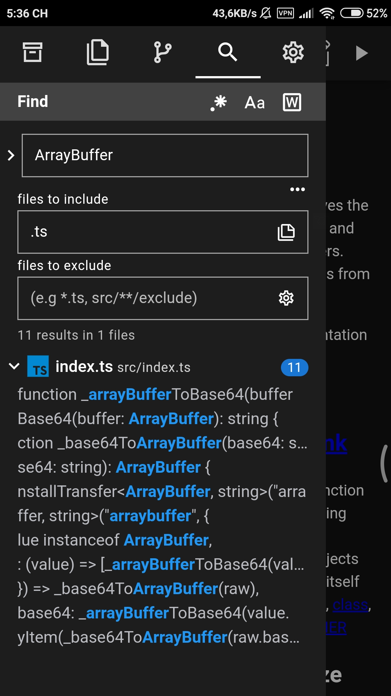

# Wecde - Shin Code Editor

Wecde (pronouced as "shIn") Editor enables you to work on JavaScript projects whenever, wherever. If its a new single-page app, a game, data visualizations, 3D simulations, or anything else that can be realized  using the magic of JavaScript, HTML, and CSS, Wecde hopes to be the code editor of your choice.

### Download App

#### iOS
[Wecde](https://wecde.github.io) is currently available on the **App Store** for **iOS 10.3+**.

---

## Features Overview

### Hints

Code hints are an essential aid to mastering external libraries. They also offer a convenience in your own code, and provide incentives to better document code with JSDoc comment strings.

### Autocompletion

Make less typos with the awesome code completion provided by the editor. Code completions are handled by the awesome TypeScript libraries provided by VS Code.

### Themes

The editor supports a variety of themes including XCode, Chrome, Dracula, Monokai, Ayu Mirage, and Ayu Light.

### Markdown

If you ever need to preview a Markdown file, you can do so right in the editor. Built upon the awesome [Markdown-it](https://github.com/markdown-it/markdown-it/) library.

### Github

Export your changes right to your Github repo. If you need to make live edits to Github, you can do so right in the editor. The editor provides basic Github integration including code diffs, highlighted files with changes, pulling and committing.

Be sure to give it a try. Also please checkout our Github [repos](https://github.com/wecde) on more info on [embedding ](https://github.com/wecde/wecde-embed) Wecde in your own site as well as libraries that Wecde is built upon.

### Import & Export Zip

An alternative to Github commits is exporting your project as a zip file. You can transfer your project to another device by the reverse operation of importing. Note that the exported file may have Unix-style newlines (meaning a single "\n" character instead of "\r\n", however, any proper code editor should handle this automatically in Windows.

### Search

Project-wide code searching is a useful tool for any JavaScript development. Navigating between files by keywords and refactoring are all made easier with an awesome fast search feature. There's still room to improve with the editor's search, so we need your [feedback](https://github.com/wecde/Shin Code-issues) on any ideas to improve the editor!

### Live Preview

Live previewing is a feature so essential, its barely worth mentioning. However... Wecde supports two modes of previewing, in a separate browser tab as well as an inline iframe for quicker edits-to-preview.

Additionally, previewing also work great in Wecde's mobile app. So if your interested in giving JavaScript development a try on your mobile device, be sure to download our [mobile app](https://play.google.com/store/apps/details?id=git.shin.code_editor&hl=en_CA&pcampaignid=MKT-Other-global-all-co-prtnr-py-PartBadge-Mar2515-1).
